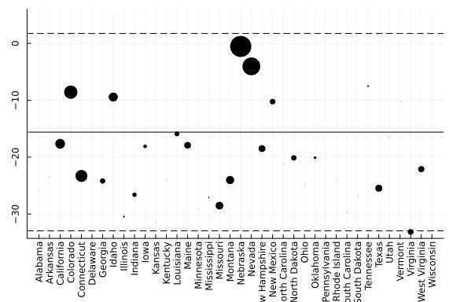

# synthdid: Synthetic Difference in Differences Estimation

This package implements the synthetic difference in difference estimator (SDID) for the average treatment effect in panel data,
as proposed in Arkhangelsky et al (2019). We observe matrices of outcomes Y and binary treatment indicators W
that we think of as satisfying Y<sub>ij</sub> = L<sub>ij</sub> + &tau;<sub>ij</sub> W<sub>ij</sub> + &epsilon;<sub>ij</sub>.
Here &tau;<sub>ij</sub> is the effect of treatment on the unit i at time j, and we estimate the average effect of
treatment when and where it happened: the average of &tau;<sub>ij</sub> over the observations with W<sub>ij</sub>=1.
All treated units must begin treatment simultaneously, so W is a block matrix: W<sub>ij</sub> = 1 for i > N<sub>0</sub> and j > T<sub>0</sub>
and zero otherwise, with N<sub>0</sub> denoting the number of control units and T<sub>0</sub> the number of observation times
before onset of treatment. This applies, in particular, to the case of a single treated unit or treated period.


This package is currently in beta and the functionality and interface is subject to change.

# Example

```julia
using Pkg
Pkg.add("synthdid")
using synthdid
```

```
summary_synth (generic function with 2 methods)
```


```julia
setup_data = panel_matrices(data("california_prop99"))
tau_hat = synthdid_estimate(setup_data.Y, setup_data.N0, setup_data.T0)
summary_synth(tau_hat, panel = setup_data);
```

```
synthdid: -15.604 +- NaN. Effective N0/N0 = 16.388/38~0.431. Effective T0/T
0 = 2.783/19 ~ 0.146. N1,T1 = 1, 12.
```


```julia
p = synthdid_plot(tau_hat)
plot(p["plot"])
```


```julia
synthdid_units_plot(tau_hat, x_ticks = setup_data.names)
```


